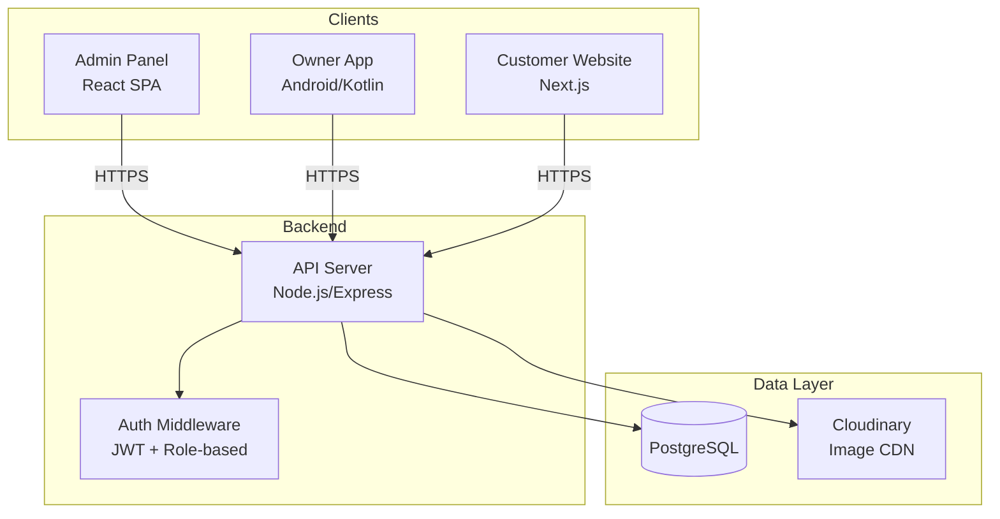
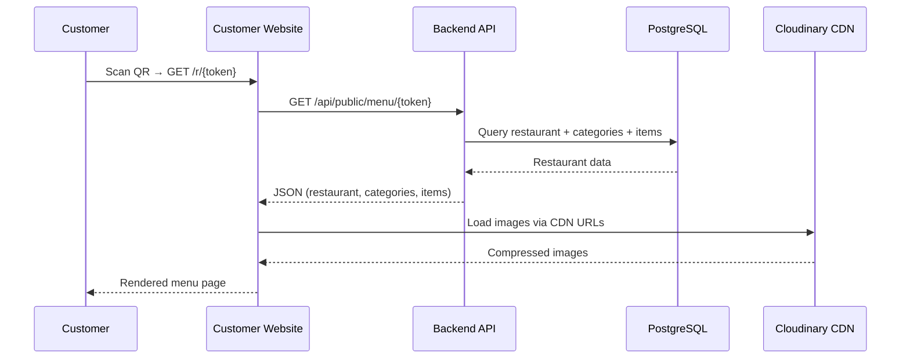
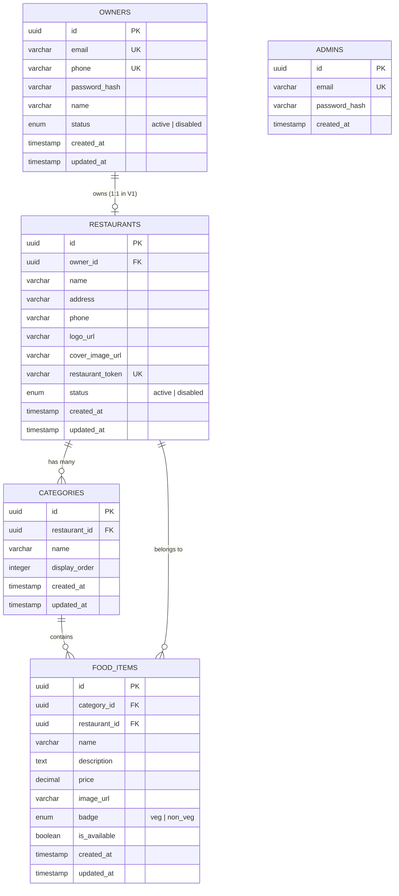

# Design Document: RestroQR V1 Digital Menu

## Overview

RestroQR V1 is a digital QR menu platform with three components sharing a single backend API:

1. **Admin Panel** — A web dashboard (React SPA) for the platform super admin to manage restaurants and owner accounts.
2. **Owner App** — An Android application (Kotlin) for restaurant owners to register, set up their restaurant, build menus, and download a single permanent QR code.
3. **Customer Website** — A public Next.js web application (restroqr.com) where customers scan a QR code and view the restaurant's menu (read-only, no ordering).

All three clients communicate with a single RESTful backend API built with Node.js (Express) backed by PostgreSQL for relational data and Cloudinary (or S3) for image storage.

### Key Design Decisions

| Decision | Rationale |
|----------|-----------|
| Single REST API backend | Simplifies deployment, auth, and data consistency across all 3 clients |
| PostgreSQL | Relational data (restaurants, categories, items) with strong integrity constraints |
| JWT authentication | Stateless auth suitable for mobile + web clients; role-based (admin vs owner) |
| Single permanent QR per restaurant | Token is immutable once assigned; menu updates reflected at same URL |
| Next.js for Customer Website | SSR/ISR for fast initial load, SEO-friendly, mobile-first rendering |
| React SPA for Admin Panel | Internal tool; SPA is sufficient, no SEO needed |
| Cloudinary for images | Handles upload, compression, CDN delivery, format conversion |

---

## Architecture

### System Architecture Diagram



### Data Flow



### Component Responsibilities

| Component | Responsibility |
|-----------|---------------|
| API Server | Business logic, validation, auth, CRUD operations, QR token generation |
| PostgreSQL | Persistent storage for all structured data |
| Cloudinary | Image upload, storage, transformation (resize/compress to ≤200KB), CDN delivery |
| Admin Panel | UI for admin to manage restaurants and owner accounts |
| Owner App | UI for owner registration, profile setup, menu management, QR download |
| Customer Website | Server-rendered menu display with search/filter, mobile-first |

---

## Components and Interfaces

### Backend API Endpoints

#### Authentication

| Method | Endpoint | Access | Description |
|--------|----------|--------|-------------|
| POST | /api/auth/register | Public | Register new restaurant owner |
| POST | /api/auth/login | Public | Login (owner or admin) |

#### Admin Endpoints

| Method | Endpoint | Access | Description |
|--------|----------|--------|-------------|
| GET | /api/admin/restaurants | Admin | List all restaurants (paginated) |
| GET | /api/admin/restaurants/:id | Admin | Get restaurant details |
| PUT | /api/admin/restaurants/:id | Admin | Edit restaurant details |
| PATCH | /api/admin/restaurants/:id/status | Admin | Enable/disable restaurant |
| DELETE | /api/admin/restaurants/:id | Admin | Delete restaurant (cascade) |
| GET | /api/admin/owners | Admin | List all owner accounts |
| GET | /api/admin/owners/:id | Admin | Get owner details |
| PATCH | /api/admin/owners/:id/status | Admin | Enable/disable owner account |

#### Owner Endpoints

| Method | Endpoint | Access | Description |
|--------|----------|--------|-------------|
| GET | /api/owner/restaurant | Owner | Get own restaurant profile |
| POST | /api/owner/restaurant | Owner | Create restaurant profile |
| PUT | /api/owner/restaurant | Owner | Update restaurant profile |
| POST | /api/owner/restaurant/images | Owner | Upload logo/cover image |
| GET | /api/owner/categories | Owner | List categories (ordered) |
| POST | /api/owner/categories | Owner | Create category |
| PUT | /api/owner/categories/:id | Owner | Update category |
| DELETE | /api/owner/categories/:id | Owner | Delete category (cascade items) |
| PUT | /api/owner/categories/reorder | Owner | Reorder categories |
| GET | /api/owner/categories/:id/items | Owner | List items in category |
| POST | /api/owner/items | Owner | Create food item |
| PUT | /api/owner/items/:id | Owner | Update food item |
| DELETE | /api/owner/items/:id | Owner | Delete food item |
| PATCH | /api/owner/items/:id/availability | Owner | Toggle item availability |
| GET | /api/owner/qr | Owner | Get QR code (PNG download) |

#### Public Endpoints

| Method | Endpoint | Access | Description |
|--------|----------|--------|-------------|
| GET | /api/public/menu/:token | Public | Get full menu for customer view |

### Admin Panel Components (React)

```
src/
├── pages/
│   ├── LoginPage.tsx
│   ├── DashboardPage.tsx
│   ├── RestaurantsPage.tsx
│   ├── RestaurantDetailPage.tsx
│   └── OwnersPage.tsx
├── components/
│   ├── RestaurantList.tsx
│   ├── RestaurantDetail.tsx
│   ├── OwnerList.tsx
│   ├── StatusBadge.tsx
│   └── ConfirmDialog.tsx
└── services/
    ├── api.ts
    └── auth.ts
```

### Owner App Screens (Android/Kotlin)

```
app/src/main/java/com/restroqr/owner/
├── ui/
│   ├── auth/
│   │   ├── LoginFragment.kt
│   │   └── RegisterFragment.kt
│   ├── dashboard/
│   │   └── DashboardFragment.kt
│   ├── profile/
│   │   └── ProfileSetupFragment.kt
│   ├── menu/
│   │   ├── CategoriesFragment.kt
│   │   ├── FoodItemsFragment.kt
│   │   └── FoodItemFormFragment.kt
│   └── qr/
│       └── QrCodeFragment.kt
├── data/
│   ├── api/
│   │   └── RestroQrApi.kt (Retrofit)
│   ├── models/
│   │   └── *.kt
│   └── repository/
│       └── *.kt
└── di/
    └── AppModule.kt (Hilt)
```

### Customer Website Pages (Next.js)

```
src/
├── app/
│   ├── r/[token]/
│   │   └── page.tsx          (Menu page - SSR)
│   ├── error/
│   │   └── page.tsx          (Error/not found page)
│   └── layout.tsx
├── components/
│   ├── MenuHeader.tsx
│   ├── CategorySection.tsx
│   ├── FoodItemCard.tsx
│   ├── SearchBar.tsx
│   ├── FilterToggle.tsx
│   └── UnavailableBadge.tsx
└── lib/
    └── api.ts
```

---

## Data Models

### Database Schema (PostgreSQL)



### Model Definitions

#### Owner

| Field | Type | Constraints |
|-------|------|-------------|
| id | UUID | PK, auto-generated |
| email | VARCHAR(255) | Unique, nullable (if phone used) |
| phone | VARCHAR(20) | Unique, nullable (if email used) |
| password_hash | VARCHAR(255) | Required, bcrypt |
| name | VARCHAR(100) | Required |
| status | ENUM | 'active' \| 'disabled', default 'active' |
| created_at | TIMESTAMP | Auto |
| updated_at | TIMESTAMP | Auto |

**Constraint:** CHECK (email IS NOT NULL OR phone IS NOT NULL)

#### Restaurant

| Field | Type | Constraints |
|-------|------|-------------|
| id | UUID | PK, auto-generated |
| owner_id | UUID | FK → owners.id, UNIQUE (one restaurant per owner in V1) |
| name | VARCHAR(100) | Required |
| address | VARCHAR(250) | Required |
| phone | VARCHAR(20) | Required |
| logo_url | VARCHAR(500) | Nullable |
| cover_image_url | VARCHAR(500) | Nullable |
| restaurant_token | VARCHAR(20) | Unique, URL-safe, ≥8 chars, immutable after creation |
| status | ENUM | 'active' \| 'disabled', default 'active' |
| created_at | TIMESTAMP | Auto |
| updated_at | TIMESTAMP | Auto |

#### Category

| Field | Type | Constraints |
|-------|------|-------------|
| id | UUID | PK, auto-generated |
| restaurant_id | UUID | FK → restaurants.id, ON DELETE CASCADE |
| name | VARCHAR(50) | Required |
| display_order | INTEGER | Required, default 0 |
| created_at | TIMESTAMP | Auto |
| updated_at | TIMESTAMP | Auto |

**Constraint:** UNIQUE(restaurant_id, LOWER(name)) — case-insensitive uniqueness per restaurant

#### Food Item

| Field | Type | Constraints |
|-------|------|-------------|
| id | UUID | PK, auto-generated |
| category_id | UUID | FK → categories.id, ON DELETE CASCADE |
| restaurant_id | UUID | FK → restaurants.id, ON DELETE CASCADE |
| name | VARCHAR(100) | Required |
| description | TEXT | Nullable, max 500 chars (app-enforced) |
| price | DECIMAL(8,2) | Required, CHECK (price >= 0.01 AND price <= 999999.99) |
| image_url | VARCHAR(500) | Nullable |
| badge | ENUM | 'veg' \| 'non_veg', required |
| is_available | BOOLEAN | Default true |
| created_at | TIMESTAMP | Auto |
| updated_at | TIMESTAMP | Auto |

#### Admin

| Field | Type | Constraints |
|-------|------|-------------|
| id | UUID | PK, auto-generated |
| email | VARCHAR(255) | Unique, required |
| password_hash | VARCHAR(255) | Required |
| created_at | TIMESTAMP | Auto |

### Token Generation Strategy

The `restaurant_token` is generated once when the restaurant profile is first saved:

- Algorithm: `nanoid` with custom alphabet (A-Z, a-z, 0-9) producing 10-character tokens
- Uniqueness: Verified against DB before assignment; retry on collision
- Immutability: Token column has no UPDATE trigger; application logic prevents modification
- URL format: `restroqr.com/r/{restaurant_token}`

### Image Handling

- **Upload flow**: Client → API (multipart/form-data) → Cloudinary → return CDN URL → store URL in DB
- **Validation**: Server-side file type (JPEG/PNG/WebP) and size (≤5MB) checks before upload
- **Transformation**: Cloudinary auto-compresses and resizes to max 800px width, ≤200KB for customer delivery
- **Deletion**: When a restaurant/item is deleted, corresponding Cloudinary assets are destroyed

---

## Correctness Properties

*A property is a characteristic or behavior that should hold true across all valid executions of a system — essentially, a formal statement about what the system should do. Properties serve as the bridge between human-readable specifications and machine-verifiable correctness guarantees.*

### Property 1: Pagination returns correct subset

*For any* set of N restaurants and any page number P with page size S, the paginated list endpoint should return exactly min(S, N - (P-1)*S) restaurants starting at offset (P-1)*S, and the total count should equal N.

**Validates: Requirements 1.1**

### Property 2: Disabled restaurant blocks public menu access

*For any* active restaurant with a valid menu, when the admin disables it, the public menu endpoint (`GET /api/public/menu/{token}`) should return an error response and not expose any menu data.

**Validates: Requirements 1.4, 9.2, 12.5**

### Property 3: Restaurant deletion cascades to all associated data

*For any* restaurant with C categories and I food items, when the admin deletes the restaurant, querying for that restaurant, its categories, and its food items should all return empty results.

**Validates: Requirements 1.5**

### Property 4: Re-enabling a restaurant restores public menu access

*For any* restaurant that was disabled and then re-enabled by the admin, the public menu endpoint should return the full menu data successfully.

**Validates: Requirements 1.6**

### Property 5: Disabled owner account blocks authentication

*For any* registered owner with valid credentials, when the admin disables their account, attempting to login with those same valid credentials should fail with a disabled-account error.

**Validates: Requirements 2.3, 3.5**

### Property 6: Re-enabling an owner account restores authentication

*For any* owner whose account was disabled and then re-enabled, login with valid credentials should succeed.

**Validates: Requirements 2.4**

### Property 7: Registration input validation

*For any* registration attempt, the system should accept the input if and only if: (a) at least one of email or phone is provided, (b) if email is provided it is valid format, (c) if phone is provided it is exactly 10 digits, (d) password is at least 8 characters, and (e) the email/phone is not already registered.

**Validates: Requirements 3.1, 3.4, 3.6**

### Property 8: Authentication error uniformity

*For any* failed login attempt (whether due to non-existent account, wrong password, or both), the error response should be identical in structure and message, revealing no information about which field was incorrect.

**Validates: Requirements 3.3**

### Property 9: Restaurant token generation correctness

*For any* newly created restaurant profile, the system should assign a restaurant_token that: (a) is at least 8 characters long, (b) contains only URL-safe alphanumeric characters [A-Za-z0-9], (c) is unique across all restaurants, and (d) produces a QR code that decodes to `restroqr.com/r/{restaurant_token}`.

**Validates: Requirements 4.2, 7.1, 7.2**

### Property 10: Entity update round-trip

*For any* entity (restaurant profile, category, or food item) and any valid field update, fetching the entity after the update should return the new value for the updated field while preserving all other fields unchanged.

**Validates: Requirements 1.3, 4.3, 5.3, 6.2**

### Property 11: Restaurant profile field validation

*For any* restaurant profile submission missing at least one of the required fields (name, address, phone), the system should reject the submission with a validation error identifying the missing field(s).

**Validates: Requirements 4.4**

### Property 12: Image upload validation

*For any* uploaded file, the system should accept it if and only if: (a) file size is ≤5MB, and (b) content type is one of JPEG, PNG, or WebP. Otherwise, it should reject with a descriptive error.

**Validates: Requirements 4.5**

### Property 13: Category name uniqueness (case-insensitive)

*For any* restaurant and any two category names, if they are equal when compared case-insensitively, the system should reject creation/update of the duplicate and return an error. Conversely, for any name of 1-50 characters that does not case-insensitively match an existing category in the same restaurant, creation should succeed.

**Validates: Requirements 5.1, 5.2**

### Property 14: Category deletion cascades to food items

*For any* category containing N food items, when the category is deleted, all N food items belonging to that category should be removed from the database.

**Validates: Requirements 5.4**

### Property 15: Category reorder persistence

*For any* valid permutation of a restaurant's category IDs, after submitting the reorder, fetching categories should return them in the new sequence (matching submitted order).

**Validates: Requirements 5.5**

### Property 16: Food item creation validation

*For any* food item submission, the system should accept it if and only if: (a) name is 1-100 characters, (b) price is between 0.01 and 999,999.99 inclusive, (c) badge is either 'veg' or 'non_veg', and (d) if an image is provided, it passes the image validation rules.

**Validates: Requirements 6.1, 6.5**

### Property 17: Token immutability across menu changes

*For any* sequence of menu operations (add/edit/delete categories or food items), the restaurant's token should remain identical to the token assigned at profile creation time.

**Validates: Requirements 7.4**

### Property 18: Menu items grouped by category in display order

*For any* restaurant with multiple categories and items, the public menu response should return items grouped by category, with categories ordered by their `display_order` value in ascending sequence.

**Validates: Requirements 9.4**

### Property 19: Search and filter composition

*For any* set of food items, any search string, and any badge filter (veg, non_veg, or none): the filtered results should be exactly the set of items where (a) if search is non-empty, the item's name or description contains the search string (case-insensitive substring match), AND (b) if a badge filter is active, the item's badge matches the filter. Clearing all filters should return the complete unfiltered set.

**Validates: Requirements 10.1, 10.2, 10.3, 10.4, 10.5**

### Property 20: Error pages do not leak internal information

*For any* error response from the public menu endpoint (invalid token, non-existent token, disabled restaurant), the response body should not contain UUIDs, database field names, stack traces, or any indication of whether the token format was invalid versus simply not registered.

**Validates: Requirements 12.1, 12.6**

---

## Error Handling

### API Error Response Format

All API errors follow a consistent JSON structure:

```json
{
  "success": false,
  "error": {
    "code": "VALIDATION_ERROR",
    "message": "Human-readable message",
    "details": [
      { "field": "name", "message": "Name is required" }
    ]
  }
}
```

### Error Codes

| Code | HTTP Status | Scenario |
|------|-------------|----------|
| VALIDATION_ERROR | 400 | Invalid input fields |
| AUTHENTICATION_FAILED | 401 | Invalid credentials (generic, no field leak) |
| ACCOUNT_DISABLED | 403 | Disabled owner/restaurant attempting access |
| FORBIDDEN | 403 | Insufficient permissions (e.g., owner accessing admin routes) |
| NOT_FOUND | 404 | Resource does not exist |
| CONFLICT | 409 | Duplicate registration, duplicate category name |
| FILE_TOO_LARGE | 413 | Image exceeds 5MB |
| UNSUPPORTED_FORMAT | 415 | Image not JPEG/PNG/WebP |
| RATE_LIMITED | 429 | Exceeded 60 requests/minute/IP |
| INTERNAL_ERROR | 500 | Unexpected server error (no details leaked to client) |

### Error Handling Strategies by Component

#### Backend API
- Input validation errors return 400 with field-specific details
- Authentication failures always return identical generic messages (security)
- Database constraint violations (duplicate email/phone/category name) return 409
- Unhandled exceptions are caught by global error middleware, logged internally, and return 500 with no stack trace
- Disabled restaurant/owner checks happen at middleware level for protected routes

#### Owner App (Android)
- Network errors: Show retry option with offline indicator
- Validation errors: Display inline field errors mapped from API `details` array
- Session expiry: Redirect to login screen with message
- QR generation failure: Show error with retry button

#### Customer Website
- Invalid/disabled restaurant: Show branded error page with message "This menu is currently unavailable"
- Network timeout: Show retry prompt
- Rate limiting: Show "Too many requests, please try again shortly"
- All error pages are generic — no token, UUID, or technical details exposed

### Security Error Handling Principles

1. **Never leak information**: Authentication errors do not reveal whether email/phone exists
2. **Uniform error responses**: Invalid token format and non-existent token return identical errors
3. **No stack traces in production**: Global error handler strips technical details
4. **Rate limit early**: Rate limiting middleware sits before route handlers
5. **Log internally**: All errors are logged with full context server-side for debugging

---

## Testing Strategy

### Testing Approach

The testing strategy uses a dual approach combining unit/example-based tests with property-based tests for comprehensive coverage.

### Property-Based Testing

**Library**: [fast-check](https://github.com/dubzzz/fast-check) (JavaScript/TypeScript)

**Configuration**: Minimum 100 iterations per property test.

**Tag Format**: Each property test is tagged with a comment:
```
// Feature: restroqr-v1-digital-menu, Property {N}: {property_text}
```

**Applicable Properties**: All 20 correctness properties defined above are implemented as property-based tests targeting the backend API logic layer (service/repository level) with mocked database where needed.

### Test Categories

| Category | Tool | Scope |
|----------|------|-------|
| Property-based tests | fast-check + Jest | Backend service logic, validation, filtering |
| Unit tests | Jest | Individual functions, utilities, helpers |
| Integration tests | Jest + Supertest | API endpoints end-to-end with test DB |
| Android UI tests | Espresso | Owner App screen flows |
| E2E tests | Playwright | Customer Website rendering, search/filter |
| Performance tests | Lighthouse CI | LCP < 3s, image sizes |

### Property Test Targets

| Property | Test Target (Code Under Test) |
|----------|-------------------------------|
| 1 (Pagination) | Restaurant list service |
| 2 (Disable blocks menu) | Public menu service |
| 3 (Cascade deletion) | Restaurant deletion service |
| 4 (Re-enable restores) | Restaurant status service |
| 5 (Disable blocks login) | Auth service |
| 6 (Re-enable login) | Auth service |
| 7 (Registration validation) | Registration validator |
| 8 (Error uniformity) | Auth error handler |
| 9 (Token generation) | Token generator + QR service |
| 10 (Update round-trip) | CRUD services |
| 11 (Profile validation) | Profile validator |
| 12 (Image validation) | Image upload validator |
| 13 (Category uniqueness) | Category service |
| 14 (Category cascade) | Category deletion service |
| 15 (Reorder persistence) | Category reorder service |
| 16 (Food item validation) | Food item validator |
| 17 (Token immutability) | Menu update services |
| 18 (Menu ordering) | Public menu service |
| 19 (Search/filter) | Menu filter/search service |
| 20 (Error page safety) | Error response middleware |

### Unit Test Focus Areas

- Specific example inputs for validation edge cases (empty strings, boundary values)
- Error response formatting
- JWT token creation and verification
- Password hashing and comparison
- Image URL construction

### Integration Test Focus Areas

- Full API request-response cycles with test database
- Authentication flow (register → login → access protected route)
- Cascade deletion verification at DB level
- Rate limiting behavior (60 req/min threshold)
- HTTPS redirect behavior
- Menu update reflection timing (< 5 seconds)
- Image upload to Cloudinary and compression verification

### E2E Test Focus Areas (Customer Website)

- QR URL navigation renders correct restaurant menu
- Search filtering updates in real-time
- Veg/Non-Veg filter toggles work correctly
- Responsive layout at breakpoints (320px, 375px, 768px, 1440px)
- Error pages for invalid tokens
- Unavailable item visual indicator

### Android Test Focus Areas

- Registration and login flows
- Profile setup with image upload
- Category CRUD and reorder
- Food item CRUD
- QR code download
- Offline error handling and retry
