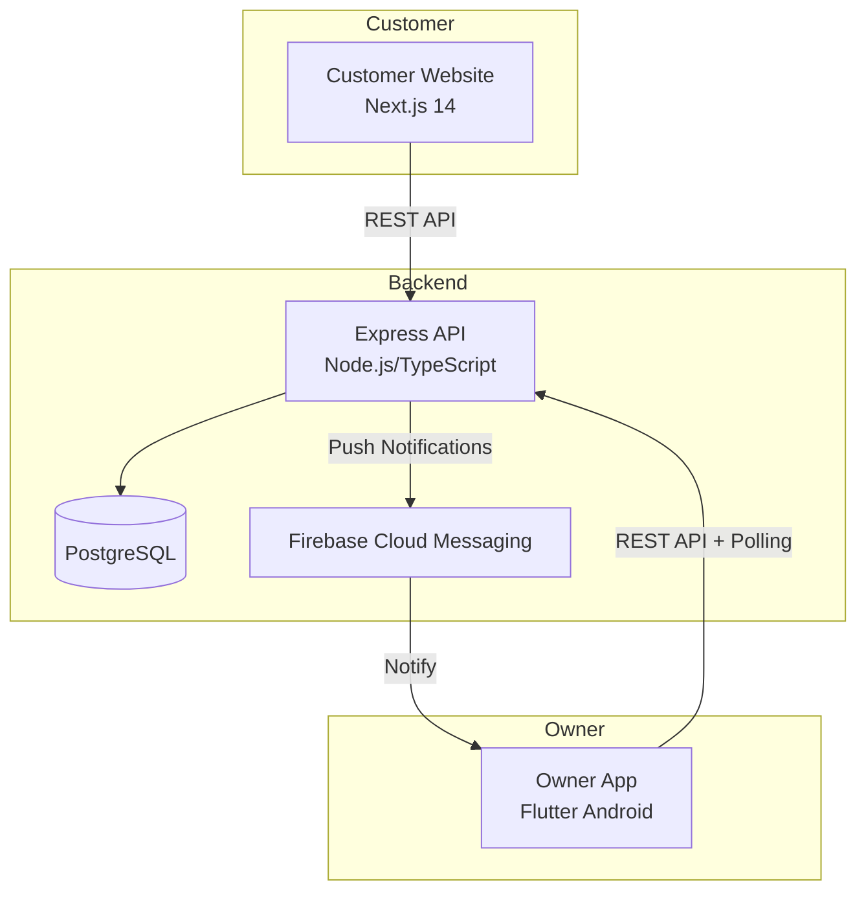
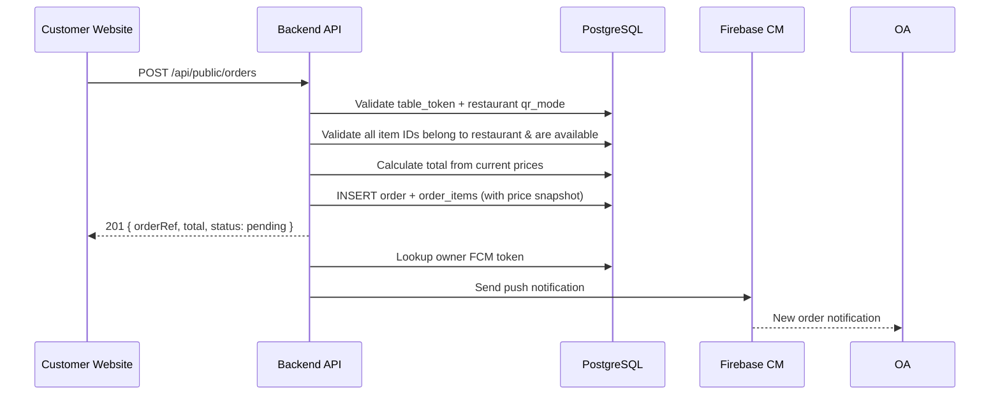
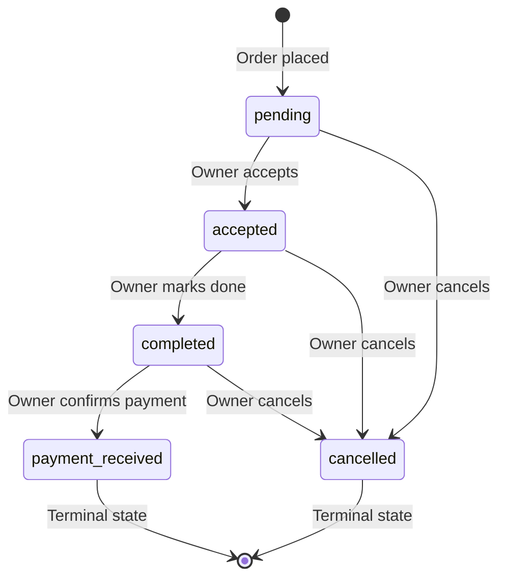

# Design Document — RestroQR V2 Ordering System

## Overview

RestroQR V2 adds a full table-wise ordering system to the existing platform. The system extends three existing codebases — a Flutter Owner App, a Next.js Customer Website, and a Node.js/Express/TypeScript Backend API — without creating new applications.

The core flow: owners configure their restaurant for multi-table QR mode, add tables (each with a cryptographically-secure token), and download per-table QR codes. Customers scan a table QR, view the restaurant menu, and place orders. The owner app shows incoming orders in real-time (via polling), supports order lifecycle management (pending → accepted → completed → payment_received), sends FCM push notifications, and provides earnings/analytics dashboards.

Key design decisions:
- **Polling over WebSockets**: The owner app polls every 10 seconds for new orders. This avoids the complexity of maintaining persistent connections on mobile and aligns with the requirement ceiling of ≤10s refresh.
- **Encrypted table tokens**: Table identifiers use AES-256-GCM encryption to prevent enumeration attacks, rather than simple random IDs.
- **Server-side price calculation**: Order totals are always computed server-side from current item prices at order time, preventing price manipulation.
- **Snapshot-on-order**: Item names and prices are captured into `order_items` at order creation, so historical orders remain accurate even after menu changes.
- **No online payment**: V2 is counter-payment only — the `payment_received` status is set by the owner after physical payment.

## Architecture



### System Architecture Principles

1. **Additive changes only**: All V2 features are new routes, services, migrations, screens, and pages added alongside existing V1 code. No existing V1 functionality is modified or broken.
2. **Service layer pattern**: Business logic lives in service modules (`orderService.ts`, `tableService.ts`, `notificationService.ts`), routes handle HTTP concerns only.
3. **Middleware reuse**: V2 routes reuse the existing `authenticate` and `requireRole` middleware.
4. **Consistent error handling**: V2 uses the same `AppError` hierarchy and `errorHandler` middleware.

### Request Flow — Order Placement



## Components and Interfaces

### New Backend Services

| Service | File | Responsibility |
|---------|------|---------------|
| `tableService.ts` | `backend/src/services/tableService.ts` | Table CRUD, token encryption/decryption, QR URL generation |
| `orderService.ts` | `backend/src/services/orderService.ts` | Order creation, status transitions, validation, total calculation |
| `notificationService.ts` | `backend/src/services/notificationService.ts` | FCM token registration, push notification dispatch |
| `earningsService.ts` | `backend/src/services/earningsService.ts` | Revenue aggregation, per-item analytics, paginated history |

### New Backend Routes

| Route File | Base Path | Auth | Purpose |
|-----------|-----------|------|---------|
| `owner/tables.ts` | `/api/owner/tables` | owner | Table CRUD, QR download |
| `owner/orders.ts` | `/api/owner/orders` | owner | Order list, status update, cancel |
| `owner/earnings.ts` | `/api/owner/earnings` | owner | Earnings summary, analytics |
| `owner/notifications.ts` | `/api/owner/notifications` | owner | FCM token register/unregister |
| `owner/settings.ts` | `/api/owner/settings` | owner | QR mode toggle |
| `public/orders.ts` | `/api/public/orders` | none | Order placement from customer |

### API Endpoint Specifications

#### QR Mode Settings

```
PATCH /api/owner/settings/qr-mode
Body: { "qrMode": "single" | "multi" }
Response: { "success": true, "data": { "qrMode": "multi" } }
```

#### Table Management

```
POST   /api/owner/tables          — Create table (body: { displayName })
GET    /api/owner/tables          — List all tables
PATCH  /api/owner/tables/:id      — Update display name
DELETE /api/owner/tables/:id      — Delete table
GET    /api/owner/tables/:id/qr   — Download QR code PNG
```

#### Order Placement (Public)

```
POST /api/public/orders
Body: {
  "tableToken": "encrypted-token-string",
  "items": [
    { "itemId": "uuid", "quantity": 2 },
    { "itemId": "uuid", "quantity": 1 }
  ]
}
Response 201: {
  "success": true,
  "data": {
    "orderRef": "ORD-A1B2C3",
    "total": "450.00",
    "status": "pending",
    "items": [{ "name": "Butter Chicken", "quantity": 2, "price": "200.00" }, ...]
  }
}
```

#### Order Management (Owner)

```
GET    /api/owner/orders?status=pending&page=1&pageSize=20  — List orders
PATCH  /api/owner/orders/:id/status     — Update status (body: { status })
POST   /api/owner/orders/:id/cancel     — Cancel order
```

#### Earnings & Analytics

```
GET /api/owner/earnings/summary?month=2025-01        — Monthly summary
GET /api/owner/earnings/breakdown?period=daily&month=2025-01  — Breakdown
GET /api/owner/earnings/history?page=1&pageSize=20&status=payment_received  — Order history
GET /api/owner/analytics/items?period=monthly&month=2025-01  — Per-item analytics
```

#### Notifications

```
POST   /api/owner/notifications/register    — Register FCM token (body: { fcmToken })
DELETE /api/owner/notifications/unregister  — Unregister FCM token
```

### Table Token Encryption

The `tableService` uses AES-256-GCM to encrypt table identifiers:

```typescript
// Encryption: tableId (UUID) → URL-safe base64 token
function encryptTableToken(tableId: string, restaurantId: string): string {
  const payload = `${restaurantId}:${tableId}`;
  const iv = crypto.randomBytes(12);
  const cipher = crypto.createCipheriv('aes-256-gcm', SECRET_KEY, iv);
  const encrypted = Buffer.concat([cipher.update(payload, 'utf8'), cipher.final()]);
  const tag = cipher.getAuthTag();
  // Format: base64url(iv + tag + ciphertext)
  return Buffer.concat([iv, tag, encrypted]).toString('base64url');
}

// Decryption: token → { restaurantId, tableId }
function decryptTableToken(token: string): { restaurantId: string; tableId: string } {
  const data = Buffer.from(token, 'base64url');
  const iv = data.subarray(0, 12);
  const tag = data.subarray(12, 28);
  const ciphertext = data.subarray(28);
  const decipher = crypto.createDecipheriv('aes-256-gcm', SECRET_KEY, iv);
  decipher.setAuthTag(tag);
  const decrypted = decipher.update(ciphertext) + decipher.final('utf8');
  const [restaurantId, tableId] = decrypted.split(':');
  return { restaurantId, tableId };
}
```

### Order Status State Machine



Valid transitions are enforced by the `orderService`:
- `pending` → `accepted` | `cancelled`
- `accepted` → `completed` | `cancelled`
- `completed` → `payment_received` | `cancelled`
- `payment_received` → (no further transitions)
- `cancelled` → (no further transitions)

## Data Models

### New Database Tables

#### `tables` table

| Column | Type | Constraints | Description |
|--------|------|-------------|-------------|
| id | uuid | PK, default uuid_generate_v4() | Table record ID |
| restaurant_id | uuid | FK → restaurants(id) ON DELETE CASCADE, NOT NULL | Owning restaurant |
| display_name | varchar(50) | NOT NULL | Human-readable name (e.g., "Table 5") |
| table_token | varchar(200) | NOT NULL, UNIQUE | Encrypted URL-safe token |
| created_at | timestamp | NOT NULL, default NOW() | Creation timestamp |
| updated_at | timestamp | NOT NULL, default NOW() | Last update timestamp |

#### `orders` table

| Column | Type | Constraints | Description |
|--------|------|-------------|-------------|
| id | uuid | PK, default uuid_generate_v4() | Order ID |
| restaurant_id | uuid | FK → restaurants(id), NOT NULL | Restaurant |
| table_id | uuid | FK → tables(id), NOT NULL | Table that placed the order |
| order_ref | varchar(20) | NOT NULL, UNIQUE | Human-readable reference (e.g., "ORD-A1B2C3") |
| status | order_status | NOT NULL, default 'pending' | Current lifecycle status |
| total | decimal(10,2) | NOT NULL | Server-calculated order total |
| created_at | timestamp | NOT NULL, default NOW() | Order placement time |
| accepted_at | timestamp | | When owner accepted |
| completed_at | timestamp | | When owner marked complete |
| payment_received_at | timestamp | | When payment confirmed |
| cancelled_at | timestamp | | When cancelled |
| updated_at | timestamp | NOT NULL, default NOW() | Last status change |

#### `order_items` table

| Column | Type | Constraints | Description |
|--------|------|-------------|-------------|
| id | uuid | PK, default uuid_generate_v4() | Line item ID |
| order_id | uuid | FK → orders(id) ON DELETE CASCADE, NOT NULL | Parent order |
| food_item_id | uuid | FK → food_items(id) ON DELETE SET NULL | Original item ref (nullable for deleted items) |
| item_name | varchar(100) | NOT NULL | Snapshot of item name at order time |
| item_price | decimal(8,2) | NOT NULL | Snapshot of item price at order time |
| quantity | integer | NOT NULL, CHECK (quantity >= 1) | Quantity ordered |
| created_at | timestamp | NOT NULL, default NOW() | Record creation time |

#### `fcm_tokens` table

| Column | Type | Constraints | Description |
|--------|------|-------------|-------------|
| id | uuid | PK, default uuid_generate_v4() | Record ID |
| owner_id | uuid | FK → owners(id) ON DELETE CASCADE, NOT NULL | Owner who registered |
| token | varchar(500) | NOT NULL, UNIQUE | FCM device token |
| created_at | timestamp | NOT NULL, default NOW() | Registration time |
| updated_at | timestamp | NOT NULL, default NOW() | Last update |

### Schema Modifications to Existing Tables

#### `restaurants` table — add column

| Column | Type | Default | Description |
|--------|------|---------|-------------|
| qr_mode | varchar(10) | 'single' | QR configuration: 'single' or 'multi' |

### New Enum Types

```sql
CREATE TYPE order_status AS ENUM ('pending', 'accepted', 'completed', 'payment_received', 'cancelled');
```

### Database Indexes

```sql
-- orders table indexes for efficient querying
CREATE INDEX idx_orders_restaurant_id ON orders(restaurant_id);
CREATE INDEX idx_orders_table_id ON orders(table_id);
CREATE INDEX idx_orders_status ON orders(status);
CREATE INDEX idx_orders_created_at ON orders(created_at);
CREATE INDEX idx_orders_restaurant_status ON orders(restaurant_id, status);
CREATE INDEX idx_orders_restaurant_created ON orders(restaurant_id, created_at DESC);

-- order_items indexes
CREATE INDEX idx_order_items_order_id ON order_items(order_id);
CREATE INDEX idx_order_items_food_item_id ON order_items(food_item_id);

-- tables indexes
CREATE INDEX idx_tables_restaurant_id ON tables(restaurant_id);

-- fcm_tokens index
CREATE INDEX idx_fcm_tokens_owner_id ON fcm_tokens(owner_id);
```

### Migration Plan

New migrations (numbered sequentially after existing 006):
1. `007_add-qr-mode-to-restaurants.js` — Add `qr_mode` column
2. `008_create-order-status-enum.js` — Create `order_status` enum type
3. `009_create-tables-table.js` — Create `tables` table
4. `010_create-orders-table.js` — Create `orders` table with indexes
5. `011_create-order-items-table.js` — Create `order_items` table with indexes
6. `012_create-fcm-tokens-table.js` — Create `fcm_tokens` table


## Correctness Properties

*A property is a characteristic or behavior that should hold true across all valid executions of a system — essentially, a formal statement about what the system should do. Properties serve as the bridge between human-readable specifications and machine-verifiable correctness guarantees.*

### Property 1: QR Mode Validation

*For any* string value submitted as `qr_mode`, the validation function SHALL accept only `'single'` or `'multi'` and reject all other values with a validation error.

**Validates: Requirements 1.1**

### Property 2: Mode Switch Round-Trip Preserves Data

*For any* restaurant with N tables and M orders, performing any sequence of `qr_mode` switches (multi→single→multi, or any number of toggles) SHALL preserve all N table records and all M order records in the database without data loss.

**Validates: Requirements 1.5, 1.6, 1.7**

### Property 3: Table Token Encryption Round-Trip

*For any* valid table UUID and restaurant UUID, encrypting the pair into a table token and then decrypting that token SHALL return the original table UUID and restaurant UUID.

**Validates: Requirements 2.2, 3.1**

### Property 4: Table Token Uniqueness

*For any* set of N tables created for the same restaurant, all N generated table tokens SHALL be distinct from each other.

**Validates: Requirements 2.1**

### Property 5: Invalid Token Handling

*For any* string that is not a valid encrypted table token (random strings, malformed base64, truncated tokens, tokens encrypted with a different key), the decryption function SHALL throw a generic error without revealing internal details about the encryption scheme.

**Validates: Requirements 3.3**

### Property 6: Order Item Validation (All-or-Nothing)

*For any* order submission containing at least one item ID that either does not belong to the specified restaurant or is marked as unavailable, the Order_Service SHALL reject the entire order and create no order record.

**Validates: Requirements 4.2, 4.6**

### Property 7: Order Total Integrity

*For any* valid order with items [{price₁, qty₁}, {price₂, qty₂}, ..., {priceₙ, qtyₙ}], the stored order total SHALL equal the sum of (priceᵢ × qtyᵢ) for all i from 1 to n.

**Validates: Requirements 4.7, 10.5**

### Property 8: Initial Order State Invariant

*For any* successfully created order, the initial status SHALL always be `'pending'` and the order SHALL be associated with the correct table_id from the submission.

**Validates: Requirements 4.3**

### Property 9: Multiple Orders Per Table

*For any* active table, submitting N valid orders (where N ≥ 1) SHALL create N distinct order records all associated with that table, with no constraint violation.

**Validates: Requirements 4.5**

### Property 10: Status Transition Enforcement

*For any* order in state S, attempting a transition to state T SHALL succeed if and only if (S, T) is in the set of valid transitions: {(pending, accepted), (accepted, completed), (completed, payment_received)}. All other forward transitions SHALL be rejected with a validation error.

**Validates: Requirements 5.1, 5.2, 5.3**

### Property 11: Cancellation Rules

*For any* order in state S where S ∈ {pending, accepted, completed}, cancellation SHALL succeed and set the status to `'cancelled'`. *For any* order in state `'payment_received'` or `'cancelled'`, cancellation SHALL be rejected.

**Validates: Requirements 5.4**

### Property 12: Transition Timestamps

*For any* valid status transition from state S to state T, the corresponding timestamp column (accepted_at, completed_at, payment_received_at, or cancelled_at) SHALL be set to a non-null value equal to or after the order's created_at timestamp.

**Validates: Requirements 5.6**

### Property 13: Notification Payload Completeness

*For any* order with a table display name and order total, the constructed FCM notification payload SHALL contain both the table display name string and the order total value.

**Validates: Requirements 7.3**

### Property 14: Earnings Filter

*For any* set of orders with mixed statuses, the earnings calculation SHALL sum only orders where status equals `'payment_received'`, ignoring all orders in other states.

**Validates: Requirements 8.3**

### Property 15: Pagination Correctness

*For any* set of N orders and a page request with page number P and page size S (default 20), the response SHALL contain at most S items, and the total count SHALL equal N. Items on page P SHALL be the subset from index ((P-1)×S) to min(P×S, N) of the sorted result set.

**Validates: Requirements 8.5**

### Property 16: Analytics Aggregation

*For any* food item, the reported total quantity sold SHALL equal the sum of quantities across all order_items referencing that food item where the parent order has status `'payment_received'`. The reported revenue SHALL equal the sum of (item_price × quantity) for those same records.

**Validates: Requirements 9.1, 9.4**

### Property 17: Snapshot Preservation After Item Deletion

*For any* order_items record that references a food_item, if that food_item is subsequently deleted from the food_items table, the order_items record SHALL retain its `item_name` and `item_price` values unchanged.

**Validates: Requirements 10.3**

## Error Handling

### Error Response Format

All V2 endpoints follow the existing error response pattern:

```json
{
  "success": false,
  "error": {
    "code": "ERROR_CODE",
    "message": "Human-readable description",
    "details": []  // Optional validation details
  }
}
```

### Error Scenarios by Domain

#### Table Management Errors

| Scenario | HTTP Status | Error Code | Message |
|----------|-------------|------------|---------|
| Create table when qr_mode is 'single' | 403 | QR_MODE_SINGLE | Table management requires multi-QR mode |
| Table not found | 404 | NOT_FOUND | Table not found |
| Display name too long (>50 chars) | 400 | VALIDATION_FAILED | Display name must not exceed 50 characters |
| Duplicate display name in same restaurant | 409 | CONFLICT | A table with this name already exists |

#### Order Placement Errors

| Scenario | HTTP Status | Error Code | Message |
|----------|-------------|------------|---------|
| Invalid table token | 404 | NOT_FOUND | Menu not found |
| Restaurant in single mode | 404 | NOT_FOUND | Menu not found |
| Item not found or wrong restaurant | 400 | VALIDATION_FAILED | Items not found: [item_ids] |
| Item unavailable | 400 | ITEMS_UNAVAILABLE | Unavailable items: [item_names] |
| Empty items array | 400 | VALIDATION_FAILED | At least one item is required |
| Invalid quantity (≤0) | 400 | VALIDATION_FAILED | Quantity must be at least 1 |

#### Order Status Errors

| Scenario | HTTP Status | Error Code | Message |
|----------|-------------|------------|---------|
| Invalid transition | 400 | INVALID_TRANSITION | Cannot transition from '{current}' to '{target}'. Allowed: [{allowed}] |
| Order not found | 404 | NOT_FOUND | Order not found |
| Cancel payment_received order | 400 | INVALID_TRANSITION | Cannot cancel an order that has been paid |

#### Notification Errors

| Scenario | Behavior |
|----------|----------|
| FCM delivery failure | Log error, do NOT fail the order creation |
| Invalid FCM token format | Return 400 VALIDATION_FAILED |
| Owner has no registered token | Skip notification silently |

### Security Considerations

1. **Token decryption failures**: All decryption failures (invalid format, wrong key, tampered data) return the same generic 404 "Menu not found" — no information leakage about the encryption scheme.
2. **Owner isolation**: All owner endpoints verify that the authenticated owner owns the restaurant. Cross-restaurant access returns 404 (not 403) to prevent resource enumeration.
3. **Rate limiting**: The existing `publicRateLimiter` applies to order placement to prevent abuse.

## Testing Strategy

### Testing Framework

- **Unit/Property Tests**: Jest + fast-check (already configured in the project)
- **Integration Tests**: Jest + supertest (already configured)
- **Frontend Tests**: Flutter widget tests (owner app), Jest + React Testing Library (customer website)

### Property-Based Testing Configuration

Property-based tests use `fast-check` with the project's existing `assertProperty` helper that enforces minimum 100 iterations. Each property test references its design document property.

Tag format: **Feature: restroqr-v2-ordering-system, Property {number}: {property_text}**

### Test Organization

```
backend/src/tests/properties/
├── table.properties.test.ts       — Properties 3, 4, 5
├── order.properties.test.ts       — Properties 6, 7, 8, 9
├── order-status.properties.test.ts — Properties 10, 11, 12
├── qr-mode.properties.test.ts     — Properties 1, 2
├── notification.properties.test.ts — Property 13
├── earnings.properties.test.ts    — Properties 14, 15, 16
├── data-integrity.properties.test.ts — Property 17
```

### Unit Tests (Example-Based)

Unit tests cover:
- QR mode toggle happy paths (1.2, 1.3)
- Table CRUD operations (2.4, 2.5)
- Order confirmation response format (4.4)
- Customer-facing error pages (3.2, 3.4)
- Notification dispatch on order creation (7.2, 7.4)
- Earnings breakdown calculation (8.1, 8.2)

### Integration Tests

Integration tests cover:
- End-to-end order placement flow (table scan → order → confirmation)
- FCM token registration and notification dispatch (7.1, 7.2, 7.5, 7.6)
- Owner polling for orders (6.5)
- QR code PNG generation (2.7)
- Database migration verification (10.1, 10.2, 10.4)

### Testing Approach by Layer

| Layer | Strategy | Tools |
|-------|----------|-------|
| Service functions (pure logic) | Property-based + unit tests | fast-check, Jest |
| Route handlers | Integration tests | supertest, Jest |
| Database schema | Migration smoke tests | node-pg-migrate |
| Flutter UI | Widget tests | Flutter test framework |
| Next.js pages | Component + E2E tests | Jest, React Testing Library |
| FCM integration | Mock-based unit tests | Jest mocks |
