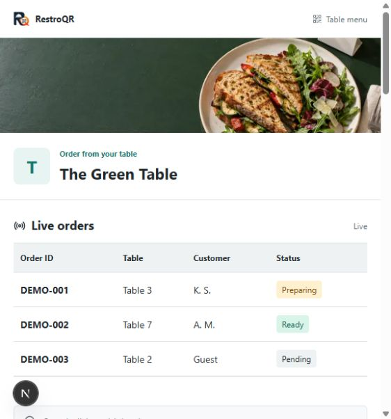
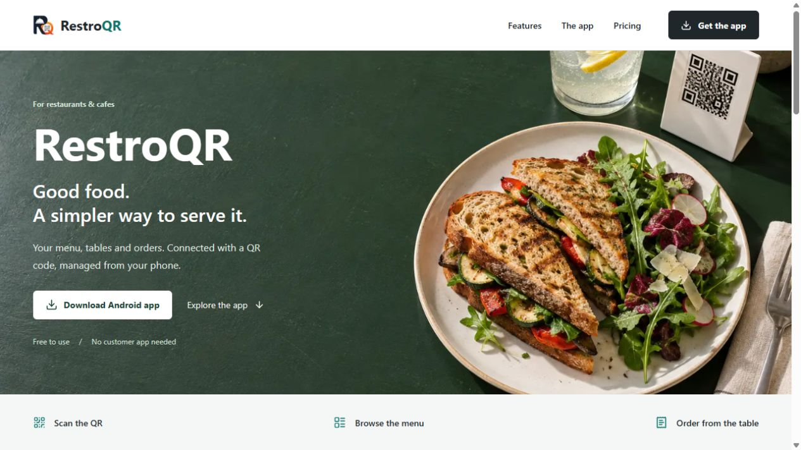
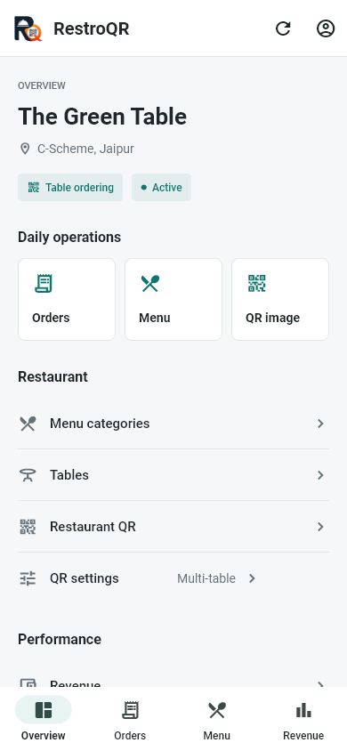
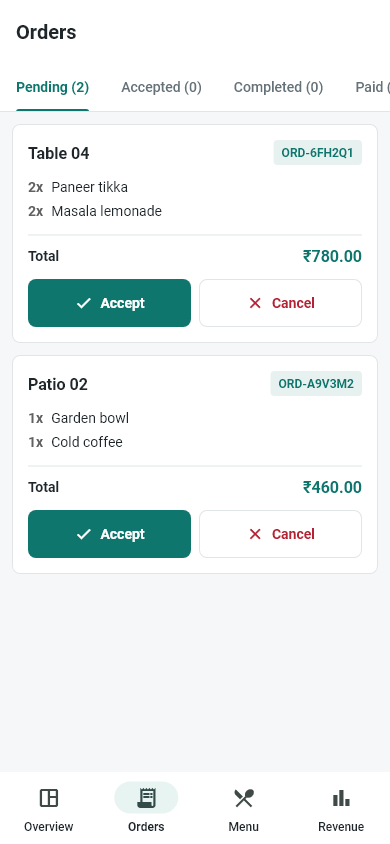
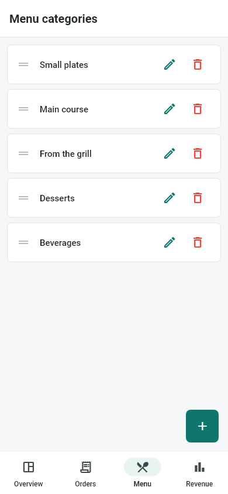
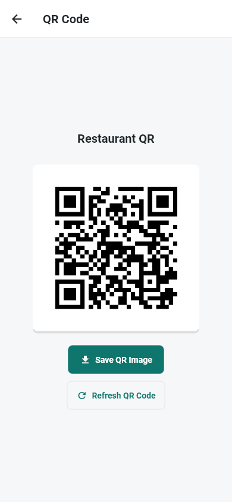

<p align="center">
  
</p>

<h1 align="center">RestroQR</h1>
<p align="center"><strong>Digital menus, table QR ordering and restaurant operations.</strong></p>
<p align="center">
  <a href="https://restroqr.thekartiksharma.in">Customer Website</a> |
  <a href="DEPLOYMENT.md">Deployment</a> |
  <a href="TECHNICAL.md">Architecture</a> |
  <a href="SECURITY.md">Security</a>
</p>

RestroQR connects a Flutter Android owner app, a mobile-friendly customer website,
an administrative dashboard and a PostgreSQL-backed API. Customers browse a menu
without an account; table QR codes enable ordering. Owners manage dishes, tables,
incoming orders and earnings.

> Repository updates are not proof of a successful production deployment.
> The linked website may run an earlier release. See the [verification record](docs/VERIFICATION.md)
> for tested functionality and release limitations.

## Screenshots

Screenshots show local development builds with sample restaurant data.

### Customer Menu and Live Order Board



### Customer Website



### Android Owner App

<table>
  <tr>
    <td align="center"><br />Overview</td>
    <td align="center"><br />Orders</td>
  </tr>
  <tr>
    <td align="center"><br />Menu</td>
    <td align="center"><br />QR codes</td>
  </tr>
</table>

## Features

| Area | Available functionality |
| --- | --- |
| Customer menu | Categories, dish images, vegetarian filters, search and availability |
| Table ordering | Cart review, server-priced orders and reference-number confirmation |
| Public order board | Restaurant-scoped recent orders, table labels, customer initials and 15-second refresh |
| Android owner app | Menu editing, table management, QR mode selection and order management |
| QR downloads | Android 10+ gallery saving; document-picker fallback on older Android |
| Operations | Earnings, item analytics and order history |
| Administration | Owner and restaurant management behind role-based authentication |
| Notifications | Firebase Cloud Messaging when project credentials and device tokens are configured |

Order lifecycle: **Pending -> Preparing -> Ready -> Paid**, with cancellation where permitted.
The owner API stores these as `pending -> accepted -> completed -> payment_received`.

**Loyalty rewards are disabled** until customer identity verification is implemented.
The public board exposes initials, not phone numbers, totals or order contents.
It shows up to 100 orders created in the last 24 hours; final states remain visible
for 30 minutes after their latest update. This is polling, not a WebSocket stream.

## Stack

- **Customer:** Next.js 15, React 19, TypeScript, Tailwind CSS 4.
- **Backend:** Express 5, TypeScript, PostgreSQL, JWT, bcrypt, Cloudinary and Firebase Admin.
- **Owner:** Flutter / Dart, Provider, Dio and native Android storage integration.
- **Admin:** React 18, Vite, TypeScript and Tailwind CSS 3.

## Local Setup

Use Node.js 24 LTS, PostgreSQL 16+ and Flutter compatible with Dart 3.11.1
(local validation used Flutter 3.41.4). Android builds require the Android SDK and JDK 17.
See [setup](docs/SETUP.md) for secrets, image uploads, notifications and emulator networking.

### Backend

Create a dedicated development database before running migrations.
Do not use production credentials for local development.

```powershell
cd backend
Copy-Item .env.example .env
# Fill in DATABASE_URL and generate independent JWT_SECRET / TABLE_TOKEN_SECRET.
npm ci
npm run migrate:up
npm run dev
```

API: `http://127.0.0.1:3000`. The health endpoint checks the process, not database readiness.

### Customer Website

```powershell
cd customer-website
Copy-Item .env.example .env.local
npm ci
npm run dev
```

Website: `http://127.0.0.1:3001`.
Set `NEXT_PUBLIC_API_URL` to the backend origin **without** `/api`.

### Admin Dashboard

```powershell
cd admin-panel
Copy-Item .env.example .env.local
npm ci
npm run dev -- --host 127.0.0.1
```

Admin: `http://127.0.0.1:5173`.
Set `VITE_API_URL` to the backend URL **with** `/api`.
Create an administrator using the backend seed command only on your intended database.

### Android Owner App

```powershell
cd owner-app-flutter
flutter pub get
adb reverse tcp:3000 tcp:3000
flutter run --dart-define=API_BASE_URL=http://127.0.0.1:3000/api
```

Android emulator networking and release signing are covered in [setup](docs/SETUP.md).
Use an HTTPS API for production.

## Repository Map

```text
backend/              Express API, SQL migrations and automated tests
customer-website/     Customer menu, table ordering and introductory website
admin-panel/          Administrative React dashboard
owner-app-flutter/    Active Android owner application
owner-app/            Legacy Android asset directory (retained)
docs/                 Setup, API reference, screenshots and verification notes
```

## Checks

```powershell
# backend
npm test -- --runInBand
npm run build

# customer-website and admin-panel (run inside each directory)
npm run build

# owner-app-flutter
flutter analyze
flutter test
```

Some suites use mocked database access. Passing tests do not certify a live PostgreSQL
deployment. See [testing](TESTING-AND-DEPLOYMENT-GUIDE.md).

## Documentation

- [Setup and configuration](docs/SETUP.md)
- [Architecture and data flow](TECHNICAL.md)
- [Public API reference](docs/API.md)
- [Deployment and rollback](DEPLOYMENT.md)
- [Testing and release checklist](TESTING-AND-DEPLOYMENT-GUIDE.md)
- [Verification and known limitations](docs/VERIFICATION.md)
- [Security reporting](SECURITY.md)
- [Contribution guidelines](CONTRIBUTING.md)
- [Change history](CHANGELOG.md)
- [Third-party notices](THIRD_PARTY_NOTICES.md)

## License

The [proprietary notice](LICENSE) preserves the existing licensing statement.
The existing repository identifies RestroQR as proprietary software by Kartik Sharma
(CodeUpPath). No new open-source license is granted by this documentation refresh.
Third-party dependencies retain their own licenses; see [notices](THIRD_PARTY_NOTICES.md).
